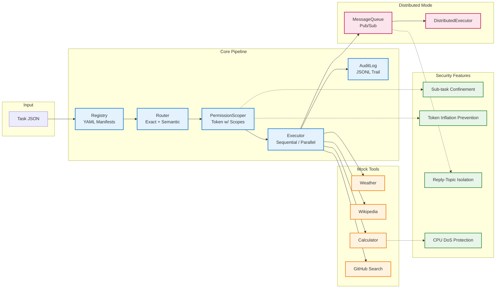

# Multi-Tool Orchestrator Agent

<p align="center">
  
  
  
  
  
</p>

A **permission-scoped multi-tool orchestration agent** for learning and reference. Run complex multi-step tasks with tool routing, scope confinement, and audit trails — all in ~1,500 lines of clean Python.

---

## TL;DR

```bash
# Clone & install (works from ANY directory)
git clone https://github.com/Bappaditya-kuilya/Multi-tool_Orchestrator_Agent
cd Multi-tool_Orchestrator_Agent
pip install -e .

# Run a demo (4 tools, parallel, semantic matching)
python -m src.cli run examples/demo-task.json
python -m src.cli run --parallel examples/demo-task.json
python -m src.cli run --semantic examples/demo-task.json
```

---

## Architecture at a Glance



---

## Quick Commands

| Command | What it does |
|---------|--------------|
| `python -m src.cli run <task.json>` | Execute a task |
| `python -m src.cli run --parallel <task.json>` | Run independent steps in parallel |
| `python -m src.cli run --semantic <task.json>` | Use semantic capability matching |
| `python -m src.cli list-tools` | Show all available tools |
| `python -m src.cli validate` | Validate manifest directory |

**Exit codes:** `0` = success, `1` = usage error, `2` = runtime error

---

## The Demo Task

```json
{
  "task_id": "demo-1",
  "steps": [
    {"id": "calc-1", "capability": "calculator", "input": {"expression": "2 + 2 * 3"}},
    {"id": "weather-1", "capability": "weather", "input": {"location": "London"}},
    {"id": "wiki-1", "capability": "wikipedia", "input": {"query": "Python (programming language)"}},
    {"id": "gh-1", "capability": "github-search", "input": {"query": "pydantic"}}
  ]
}
```

Run it:
```bash
python -m src.cli run examples/demo-task.json
```

Output:
```json
{
  "task_id": "demo-1",
  "results": {
    "calc-1": {"success": true, "output": {"expression": "2 + 2 * 3", "result": 8.0}},
    "weather-1": {"success": true, "output": {"location": "London", "temperature_c": 18, "condition": "Cloudy", "humidity": 80}},
    "wiki-1": {"success": true, "output": {"title": "Python (programming language)", "summary": "Python is a high-level...", "url": "https://en.wikipedia.org/wiki/Python_(programming_language)"}},
    "gh-1": {"success": true, "output": {"total_count": 42, "items": [{"name": "pydantic", "full_name": "pydantic/pydantic", "description": "Data validation...", "stargazers_count": 15000, "html_url": "https://github.com/pydantic/pydantic"}]}}
  }
}
```

---

## Built-in Tools (Mock)

| Tool | Capability | What it does |
|------|------------|--------------|
| `mock-weather` | `weather` | Current weather for 5 cities (deterministic with seed) |
| `mock-wikipedia` | `wikipedia` | Article summaries for Python, AI, ML |
| `mock-calculator` | `calculator` | Safe math: `+ - * / // % **` and unary ops |
| `mock-calculator-advanced` | `calculator` | Advanced: `sqrt`, `abs`, `round`, `min`, `max` |
| `mock-github-search` | `github-search` | Search 3 repos: pydantic, fastapi, httpx |

---

## Add a New Tool in 3 Steps

### 1. Create manifest (`manifests/mock-time.yaml`)
```yaml
name: "mock-time"
display_name: "Mock Time Tool"
capability_tags: ["time"]
required_scope: "time:read"
priority: 10
input_schema:
  type: "object"
  properties:
    format:
      type: "string"
      enum: ["iso", "unix", "readable"]
output_schema:
  type: "object"
  properties:
    time: {type: "string"}
```

### 2. Implement tool (`src/tools/mock_time.py`)
```python
from __future__ import annotations
import datetime
from typing import Any
from .base import BaseTool

class MockTimeTool(BaseTool):
    async def execute(self, input_data: dict[str, Any]) -> dict[str, Any]:
        fmt = input_data.get("format", "iso")
        now = datetime.datetime.now(datetime.timezone.utc)
        if fmt == "iso":
            return {"time": now.isoformat()}
        elif fmt == "unix":
            return {"time": str(int(now.timestamp()))}
        return {"time": now.strftime("%Y-%m-%d %H:%M:%S UTC")}
```

### 3. Register it (`src/tools/__init__.py`)
```python
from .mock_time import MockTimeTool

TOOL_CLASSES = {
    # ... existing ...
    "mock-time": MockTimeTool,
}
```

### 4. Test it
```bash
cat > test-time.json << 'EOF'
{"task_id": "time-test", "steps": [{"id": "t1", "capability": "time", "input": {"format": "iso"}}]}
EOF
python -m src.cli run test-time.json
```

---

## Security Features

| Feature | How it works |
|---------|--------------|
| **Sub-task confinement** | Child orchestrators only get scopes intersecting with parent token |
| **Token inflation prevention** | Only the winning tool's scope is granted per step |
| **Reply-topic isolation** | Per-message unique reply topics + correlation IDs |
| **CPU DoS protection** | Exponent cap (`**` ≤ 1000), finiteness checks |

---

## Running Tests

```bash
# All tests (124 passing, 0 warnings)
python -m pytest tests/ -q

# Security regression tests
python -m pytest tests/test_security_*.py -q

# Finding-keyed attack regressions
python -m pytest tests/test_attacks.py -q

# From ANY directory (CWD-independent)
python -m pytest /path/to/repo/tests/ -q
```

---

## Free-LLM Layer (Stretch)

Run at $0 with free providers — **stdlib only** (`urllib.request`):

```python
from src.llm.providers import create_provider

# Offline default (zero keys)
provider = create_provider("mock")
plan = await provider.chat([{"role": "user", "content": "Calculate 2+2 and get London weather"}])

# Free providers (when keys available)
provider = create_provider("openrouter")  # openrouter/free
provider = create_provider("gemini")      # gemini-3.6-flash
provider = create_provider("groq")        # openai/gpt-oss-120b
```

---

## Project Structure

```
.
├── .github/workflows/ci.yml    # GitHub Actions: pytest + compileall
├── docs/audit.md               # Full traceability + 9.5/10 rating
├── examples/demo-task.json     # Single demo task
├── manifests/                  # 5 tool YAML manifests
├── src/
│   ├── cli.py                  # CLI with run/list/validate
│   ├── registry.py             # YAML manifest loader
│   ├── router.py               # Exact + semantic routing
│   ├── permission.py           # Token issuance
│   ├── executor.py             # Sequential + parallel execution
│   ├── orchestrator.py         # Pipeline + sub-tasks
│   ├── auditor.py              # JSONL audit trail
│   ├── message_queue.py        # In-process pub/sub
│   ├── semantic.py             # TF-IDF + synonym matcher
│   ├── models.py               # Pydantic models
│   ├── llm/providers.py        # Free-LLM providers
│   └── tools/                  # 5 mock tool implementations
��── tests/                      # 124 tests (security, integration, attacks)
```

---

## Why This Exists

> A **reference architecture** for scoped multi-tool agent orchestration.  
> Read the code, run the demos, extend with one new tool in < 15 minutes.  
> Find no code path that crashes or escalates scopes.

**Target audience:** Backend engineers evaluating permission-scoped tool delegation patterns.

---

## License

MIT — use freely, learn from it, build on it.